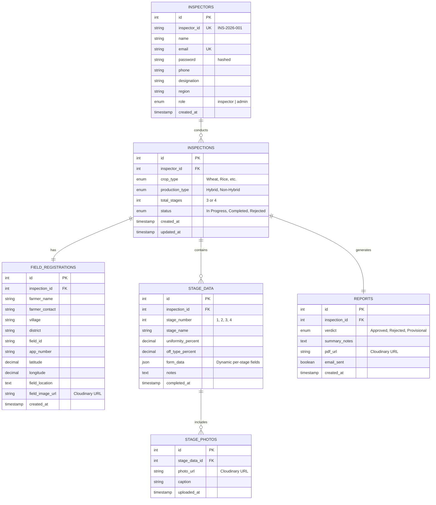

# 📊 Database Integration Design

This document outlines the complete database structure for the **Seed Inspection System**. We are using **MySQL** with **Drizzle ORM** (Vanilla JavaScript) to manage the data layers.

## 🧜‍♂️ Entity Relationship Diagram (ERD)

The following diagram illustrates how the data is connected:



---

## 🗃️ Table Definitions & Fields

### 1. `inspectors`

> **Purpose:** This is the central identity table for all users of the system.
> **Storage:** It stores the authentication credentials (emails, hashed passwords), personal details (names, phone numbers), and organizational context (designation, region) for each inspector.
> **Connection:** Connects as a parent to the `inspections` table. One inspector can perform many inspections over time.

| Field | Type | Description |
| :--- | :--- | :--- |
| `id` | `INT` (PK) | Auto-increment primary key. |
| `inspector_id` | `VARCHAR(20)` (UK) | Unique identifier (e.g., `INS-2026-001`). |
| `name` | `VARCHAR(100)` | Full name of the inspector. |
| `email` | `VARCHAR(100)` (UK) | Professional email address. |
| `password` | `VARCHAR(255)` | Salted BCrypt hash. |
| `phone` | `VARCHAR(15)` | Contact number. |
| `designation`| `VARCHAR(100)` | Role title (Field Inspector, etc.). |
| `region` | `VARCHAR(100)` | Assigned operational zone. |
| `role` | `ENUM` | Default: `'inspector'`. |

### 2. `inspections`

> **Purpose:** This is the core transactional table that tracks the lifecycle of every field visit from start to finish.
> **Storage:** It stores meta-information about the inspection itself, such as the crop being inspected, the production method (Hybrid/Non-Hybrid), and the current overall status (In Progress, Completed, or Rejected).
> **Connection:** Connects to `inspectors` (child), and acts as the primary parent for `field_registrations`, `stage_data`, and `reports`.

| Field | Type | Description |
| :--- | :--- | :--- |
| `id` | `INT` (PK) | Auto-increment primary key. |
| `inspector_id` | `INT` (FK) | Links to the `inspectors` table. |
| `crop_type` | `ENUM` | Wheat, Rice, Maize, Sorghum, Sunflower. |
| `production_type`| `ENUM` | Hybrid (4 stages) or Non-Hybrid (3 stages). |
| `total_stages` | `INT` | Calculated based on production type. |
| `status` | `ENUM` | `'In Progress'`, `'Completed'`, `'Rejected'`. |

### 3. `field_registrations`

> **Purpose:** Captures the unique physical and legal context of the agricultural land being inspected.
> **Storage:** It stores farmer contact info, precise GPS coordinates (Latitude/Longitude), and a reference image of the field/documents.
> **Connection:** Connects to the `inspections` table in a strict 1:1 relationship. Each inspection belongs to exactly one specific field layout.

| Field | Type | Description |
| :--- | :--- | :--- |
| `id` | `INT` (PK) | Auto-increment primary key. |
| `inspection_id` | `INT` (FK) | Links to the `inspections` table (1:1). |
| `farmer_name` | `VARCHAR(100)` | Name of the landowner/farmer. |
| `latitude` | `DECIMAL(10,8)` | Captured via `useGeolocation` hook. |
| `longitude` | `DECIMAL(11,8)` | Captured via `useGeolocation` hook. |
| `field_image_url`| `VARCHAR(500)` | Cloudinary URL for the field photo. |

### 4. `stage_data`

> **Purpose:** Records the actual technical observations made by the inspector during specific growth periods of the crop.
> **Storage:** It stores quantitative data (uniformity, percentages) and qualitative observations (notes) for each stage via a flexible JSON column.
> **Connection:** Connects to `inspections` (child). One inspection will typically have 3 or 4 `stage_data` records depending on the production type. It also acts as a parent to `stage_photos`.

| Field | Type | Description |
| :--- | :--- | :--- |
| `id` | `INT` (PK) | Auto-increment primary key. |
| `inspection_id` | `INT` (FK) | Links to the parent `inspections`. |
| `stage_number` | `INT` | 1 (Veg), 2 (Flowering), 3 (Pre-harvest), 4 (Seed). |
| `form_data` | `JSON` | **Crucial:** Stores all toggles and sliders as a JSON object (e.g., `{ rust: true, height: 75 }`). |
| `notes` | `TEXT` | Specific inspector remarks. |

### 5. `stage_photos`

> **Purpose:** Provides visual evidence and verification for the observations recorded in the `stage_data` table.
> **Storage:** Stores the Cloudinary links to images taken during the inspection and short descriptive captions for each photo.
> **Connection:** Connects to `stage_data` (child). One stage inspection can have multiple supporting photos.

| Field | Type | Description |
| :--- | :--- | :--- |
| `id` | `INT` (PK) | Auto-increment primary key. |
| `stage_data_id` | `INT` (FK) | Links to the specific stage. |
| `photo_url` | `VARCHAR(500)` | Cloudinary URL. |

### 6. `reports`

> **Purpose:** Houses the final outcome and certification status of the completed inspection.
> **Storage:** Stores the inspector's final verdict, summary remarks, and the link to the generated PDF report. It also tracks if the findings have been emailed to the central authority.
> **Connection:** Connects to `inspections` in a 1:1 relationship. A report can only be generated once an inspection is finalized.

| Field | Type | Description |
| :--- | :--- | :--- |
| `id` | `INT` (PK) | Auto-increment primary key. |
| `inspection_id` | `INT` (FK) | Links to the inspection. |
| `verdict` | `ENUM` | Final pass/fail decision. |
| `pdf_url` | `VARCHAR(500)` | Managed by backend after submission. |

---

## 🛠️ Drizzle ORM Schema Implementation

Below is the JavaScript implementation of the database schema using **Drizzle ORM** for MySQL. This file will be located at `server/src/db/schema.js`.

```javascript
import { 
  mysqlTable, 
  int, 
  varchar, 
  text, 
  timestamp, 
  decimal, 
  mysqlEnum, 
  json, 
  boolean 
} from 'drizzle-orm/mysql-core';

// 1. Inspectors Table
export const inspectors = mysqlTable('inspectors', {
  id:           int('id').autoincrement().primaryKey(),
  inspectorId:  varchar('inspector_id', { length: 20 }).notNull().unique(), 
  name:         varchar('name', { length: 100 }).notNull(),
  email:        varchar('email', { length: 100 }).notNull().unique(),
  password:     varchar('password', { length: 255 }).notNull(),
  phone:        varchar('phone', { length: 15 }),
  designation:  varchar('designation', { length: 100 }),
  region:       varchar('region', { length: 100 }),
  role:         mysqlEnum('role', ['inspector', 'admin']).default('inspector'),
  createdAt:    timestamp('created_at').defaultNow(),
});

// 2. Inspections Table
export const inspections = mysqlTable('inspections', {
  id:             int('id').autoincrement().primaryKey(),
  inspectorId:    int('inspector_id').references(() => inspectors.id, { onDelete: 'cascade' }),
  cropType:       mysqlEnum('crop_type', ['Wheat', 'Rice', 'Maize', 'Sorghum', 'Sunflower']).notNull(),
  productionType: mysqlEnum('production_type', ['Hybrid', 'Non-Hybrid']).notNull(),
  totalStages:    int('total_stages').notNull(),
  status:         mysqlEnum('status', ['In Progress', 'Completed', 'Rejected']).default('In Progress'),
  createdAt:      timestamp('created_at').defaultNow(),
  updatedAt:      timestamp('updated_at').onUpdateNow(),
});

// 3. Field Registrations Table
export const fieldRegistrations = mysqlTable('field_registrations', {
  id:             int('id').autoincrement().primaryKey(),
  inspectionId:   int('inspection_id').references(() => inspections.id, { onDelete: 'cascade' }),
  farmerName:     varchar('farmer_name', { length: 100 }).notNull(),
  farmerContact:  varchar('farmer_contact', { length: 15 }),
  village:        varchar('village', { length: 100 }),
  district:       varchar('district', { length: 100 }),
  fieldId:        varchar('field_id', { length: 50 }),
  appNumber:      varchar('app_number', { length: 50 }),
  latitude:       decimal('latitude', { precision: 10, scale: 8 }),
  longitude:      decimal('longitude', { precision: 11, scale: 8 }),
  fieldLocation:  text('field_location'),
  fieldImageUrl:  varchar('field_image_url', { length: 500 }),
  createdAt:      timestamp('created_at').defaultNow(),
});

// 4. Stage Data Table
export const stageData = mysqlTable('stage_data', {
  id:                   int('id').autoincrement().primaryKey(),
  inspectionId:         int('inspection_id').references(() => inspections.id, { onDelete: 'cascade' }),
  stageNumber:          int('stage_number').notNull(),
  stageName:            varchar('stage_name', { length: 100 }),
  formData:             json('form_data'), // Stores all per-crop specific inputs
  notes:                text('notes'),
  completedAt:          timestamp('completed_at'),
});

// 5. Stage Photos Table
export const stagePhotos = mysqlTable('stage_photos', {
  id:           int('id').autoincrement().primaryKey(),
  stageDataId:  int('stage_data_id').references(() => stageData.id, { onDelete: 'cascade' }),
  photoUrl:     varchar('photo_url', { length: 500 }).notNull(),
  caption:      varchar('caption', { length: 255 }),
  uploadedAt:   timestamp('uploaded_at').defaultNow(),
});

// 6. Reports Table
export const reports = mysqlTable('reports', {
  id:             int('id').autoincrement().primaryKey(),
  inspectionId:   int('inspection_id').references(() => inspections.id, { onDelete: 'cascade' }),
  verdict:        mysqlEnum('verdict', ['Approved', 'Provisional Approval', 'Rejected']).notNull(),
  summaryNotes:   text('summary_notes'),
  pdfUrl:         varchar('pdf_url', { length: 500 }),
  emailSent:      boolean('email_sent').default(false),
  createdAt:      timestamp('created_at').defaultNow(),
});
```

---

## 🔗 Key Relationships & Rules

1. **One-to-Many (1:N)**: An `inspector` can have many `inspections`.
2. **One-to-One (1:1)**: Every `inspection` has exactly one `field_registration` and one final `report`.
3. **Cascade Delete**: If an `inspection` is deleted, its `field_registration`, `stage_data`, `stage_photos`, and `report` should also be automatically removed from the database to prevent orphaned records.
4. **JSON Flexibility**: The `stage_data.form_data` field is stored as **JSON**. This is an intentional choice to handle different crops (Wheat vs. Rice) without needing dozens of specific columns.

---

> [!TIP]
> **Next Step:** Once the backend server is initialized, you can copy this code into `server/src/db/schema.js` and run `npx drizzle-kit push` to create your database tables!
